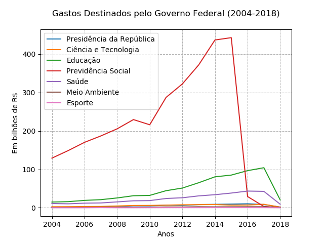

## Gastos do Governo Federal (2004-2017)

* Dados recuperados do Portal da Transparência
* Dados de gastos de órgãos superiores do período de 2004 a 2017
* Gráficos ilustrando os gastos do governo federal

### Bibliotecas

* bs4
* matplotlib
* numpy
* os
* requests
* seaborn

### Funções

* Captura de valores em bilhões de 2004 a 2017 para cada órgão superior
* Geração de gráficos para apresentar os gastos desse período para cada órgão superior
* Geração de gráfico único para apresentar os gastos de todos os órgãos superiores

### Próximos passos

* ??

### Para executar

```
    $ python3.6 main.py
```

### Resultado

```
[  1.55962595   1.73095452   2.07882325   2.68985071   3.74516803
   5.3827077    5.22677705   6.358044     6.14233284   8.37890617
   8.87569728   9.58917619  10.34178642   5.06683   ]
[ 2.64331535  2.82821771  3.28145961  3.49948086  4.65878293  6.00172914
  6.1449583   6.88098055  7.74246237  8.17613567  8.41780211  6.90502246
  7.13479031  4.94182197]
[ 14.8926      15.95702274  19.21563395  21.13415255  25.56565996
  31.36156226  32.25412522  44.45552118  51.32357498  65.15289224
  80.58221391  85.08828397  96.67688904  61.91643599]
[ 129.2075583   148.89231265  170.2999653   186.95701757  205.47119247
  229.53192666  216.07261271  287.20394134  322.29873254  371.69607266
  436.71944029  442.73582335   29.21518991    1.95373977]
[ 11.14465237  10.3673103   12.01203109  12.57543875  15.31735133
  18.17037344  18.69898142  24.15500246  26.05511257  30.92908285
  34.0412869   38.29776739  43.49132728  28.04232701]
[ 0.80123767  0.86762246  1.04931515  1.1772543   1.26357917  1.45721213
  1.43744512  2.05964199  1.88988577  2.56738382  2.28395678  2.41914772
  2.53990853  1.60370603]
[ 0.03617963  0.04071457  0.11216442  0.45174245  0.12762042  0.14712154
  0.24440603  0.31512447  0.35080008  0.3381918   0.45074431  0.43087172
  0.43738651  0.27565961]
```


