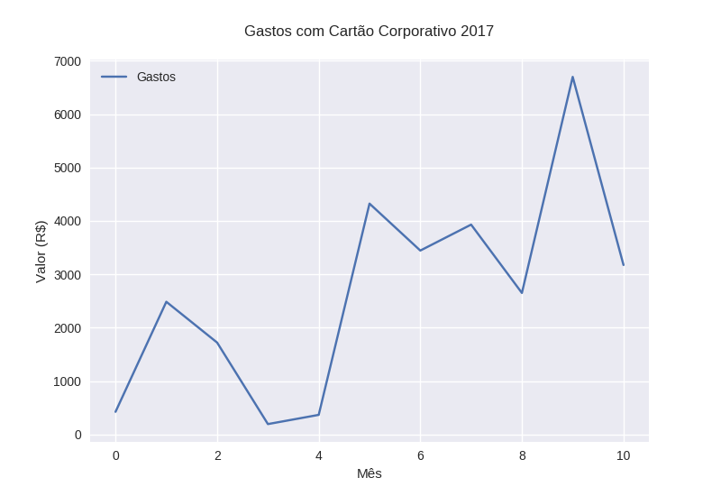
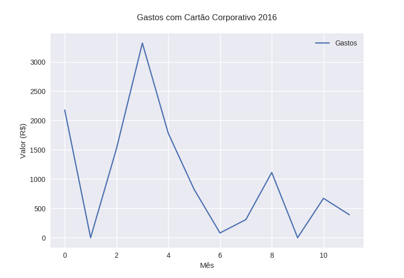
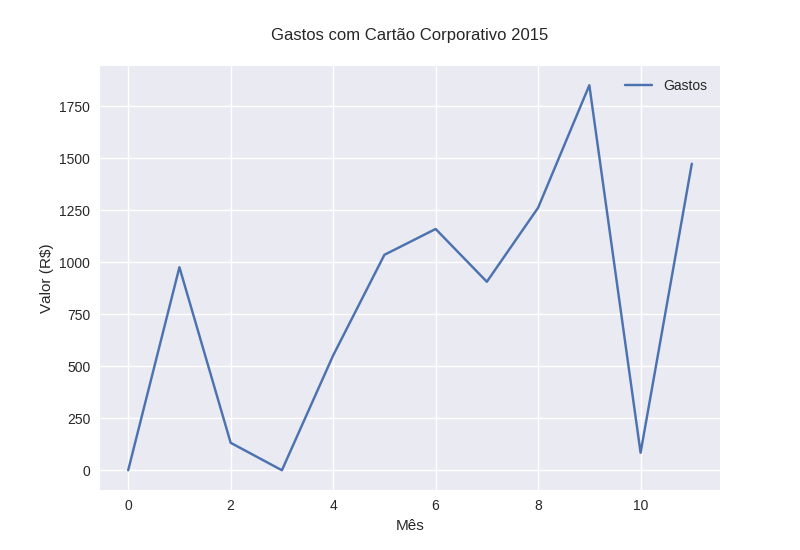

## Cartão Corporativo do Estado do CE (2015-2017)

* Dados recuperados do Portal da Transparência do Governo do Estado do Ceará
* Dados de gastos do cartão corporativo de responsabilidade do Chefe do Poder Executivo, período de 2015 a 2017
* Gráficos ilustrando os gastos do cartão corporativo
* Gráficos ilustrando a média e o desvio padrão

**em desenvolvimento**

### Bibliotecas

* bs4
* matplotlib
* numpy
* requests
* seaborn

### Funções

* Para cada ano retorna (em R$): ( média, desvio padrão)
* Para cada ano um gráfico é plotado (Gastos X Mês)

### Próximos passos

* Melhorar saída dos resultados
* Melhorar apresentação dos meses no gráfico
* Salvar gráficos em .png
* Gráfico unificado
* Refatoração

### Para executar

```
    $ python3.6 main.py

```

### Resultado

```
    Gastos com Cartão Corporativo 2017
    Média dos gastos: R$ 2674.049090909091
    Desvio padrão: R$ 1878.005249835118
    None
    Gastos com Cartão Corporativo 2016
    Média dos gastos: R$ 1016.2541666666667
    Desvio padrão: R$ 979.1299110984401
    None
    Gastos com Cartão Corporativo 2015
    Média dos gastos: R$ 786.4249999999998
    Desvio padrão: R$ 598.6808928037818
    None

```




