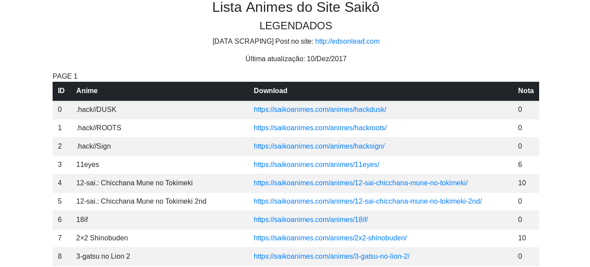
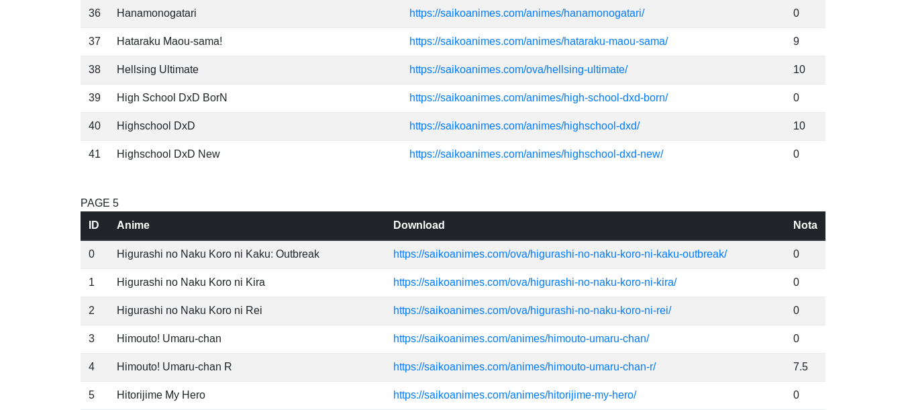
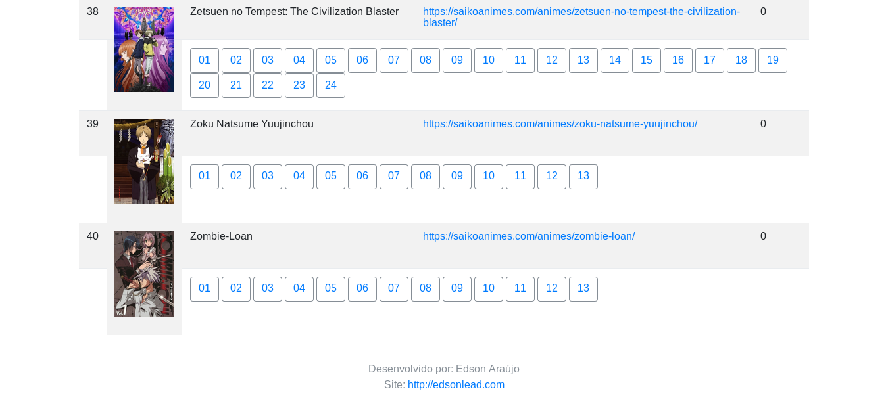

## Lista de Animes do Site Saikô

* Dados recuperados do site Saikô
* Dados: nome do anime, link para download e nota
* Lista de animes do site em tabelas html

### Bibliotecas

* bs4
* requests

### Funções

* Para cada página da lista de animes legendados, dados são adicionados a uma lista em tabela
* Para cada anime presente na lista do site é capturado: nome, link de download e nota
* A nova lista é gerada em formato .html

### Próximos passos

* ??

### Para executar

```

    $ python3.6 main.py

```

### Resultado

Link do html: http://edsonlead.com/list_anime.html






