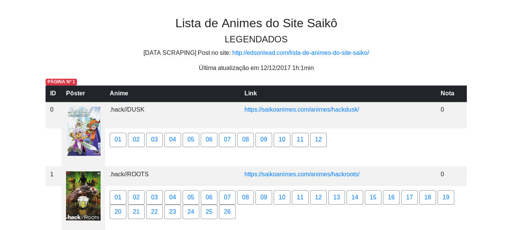
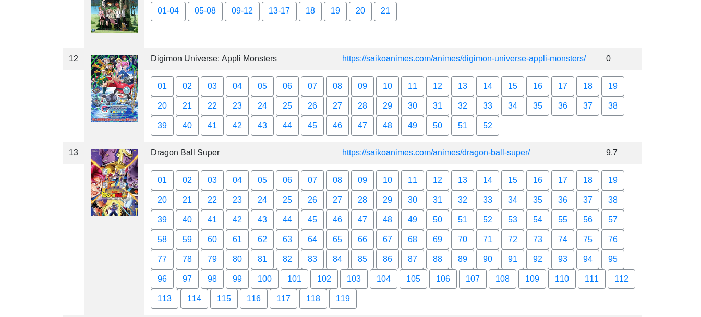

## Lista de Animes do Site Saiko

* Dados recuperados de lista de animes legendados do site Saiko
* Dados: pôster, nome, link para anime no site, nota, link de download dos episódios
* Lista de animes do site em tabelas no formato html

### Bibliotecas

* bootstrap framework
* bs4
* datetime
* requests

### Funções

* Para cada página da lista de animes legendados, dados são adicionados a uma lista em tabela
* Para cada anime presente na lista do site é capturado: pôster, nome, link para o anime no site, nota e link de downloads dos episódios
* A nova lista é gerada em formato .html

### Próximos passos

* Refatoração

### Para executar

```

    $ python3.6 main.py

```

### Resultado

Link do html: http://edsonlead.com/list_anime






